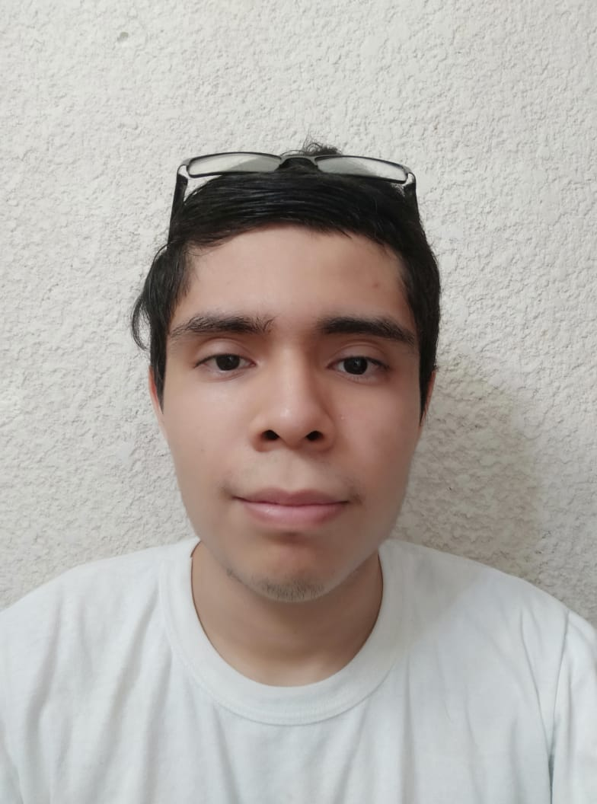

# Interacción Humano Computadora
Repositorio para el proyecto final de la Asignatura "Interacción Humano Computadora".

## Miembros del equipo:

|  |  |  |  | 
| :----: | :----: | :----: | :----: |
| [Carlos Josue Chan Gongora](https://github.com/Shadic78) | [Pedro Daniel Euan Chan](https://github.com/dongato99) | [Jorge Guerrero Orozco](https://github.com/llYOrchll) | [Juan José Durán Matos](https://github.com/Juancrack97) |

## Presentación preliminar del proyecto

* **[Diapositivas](https://www.figma.com/file/ajxmUITsF8BkxAxivxNG8P/ProyectoIHCPresentacion?node-id=0%3A1)**
* **[Referencias](https://www.figma.com/file/ajxmUITsF8BkxAxivxNG8P/ProyectoIHCPresentacion?node-id=7%3A1260)**
    * [gabinete.mx](https://gabinete.mx/images/datadato/donacion/ST_donacion_sangre_2019.pdf)
    * [cardiologia.org.mx](https://www.cardiologia.org.mx/atencion_medica/banco_de_sangre/)
    * [codigof.mx](https://codigof.mx/donar-sangre-regalar-vida/)
    * [foroconsultivo.org.mx](https://foroconsultivo.org.mx/INCyTU/index.php/notas/salud/124-30-donacion-de-sangre-en-mexico-n-2)
    * [scroll.in](https://scroll.in/pulse/841558/blood-donation-apps-are-here-to-help-in-medical-emergencies-but-where-does-the-blood-really-go)
    * [sciencedirect.com](https://www.sciencedirect.com/science/article/pii/S2666990021000045)

## Primera entrega

Los documentos que fueron generados se encuentran en la carpeta "Primera entrega" pero tambien pueden verse
de manera online en los siguientes enlaces:
* **[Primera entrega](https://alumnosuady-my.sharepoint.com/:f:/g/personal/a18016316_alumnos_uady_mx/Eikd-WKWGwZClaxpxrIkzSYBWaDTfzJcimM2fv-5Lzexeg?e=IJ2B6C)**
	* [Definición del proyecto](https://alumnosuady-my.sharepoint.com/:w:/g/personal/a18016316_alumnos_uady_mx/EXIer8UWKqpIrAZN_w3Od6QBksbNG0FqsMtnpYGp4pgmZg?e=GDToYQ)
	* [Especificación de requerimientos](https://alumnosuady-my.sharepoint.com/:w:/g/personal/a18016316_alumnos_uady_mx/EYwVGUBSwRJMmOFeztnbwrkBaWHu00cRRscMRD1-UunSRA?e=pCZ5bA)
	* [Anexo-Modelado de usuarios](https://alumnosuady-my.sharepoint.com/:w:/g/personal/a18016316_alumnos_uady_mx/EeOVmZnApQlAtbLMNzCVxgYB5ZF035ZNx2dA1nv_EPkrEQ?e=ckjCnf)
	* [Anexo-Plan de trabajo](https://alumnosuady-my.sharepoint.com/:w:/g/personal/a18016316_alumnos_uady_mx/EZTuCeeZtdxOr_Oo6QRyaCcBoB-LSV1oaYUyAvTrmupqYA?e=TE1mSo)
	* [Contribuciones](https://alumnosuady-my.sharepoint.com/:w:/g/personal/a18016316_alumnos_uady_mx/EeqhL-0HgrhFgREWEihd14wBtzET8zrN0X3t06_r8RvgtA?e=CQYTLy)