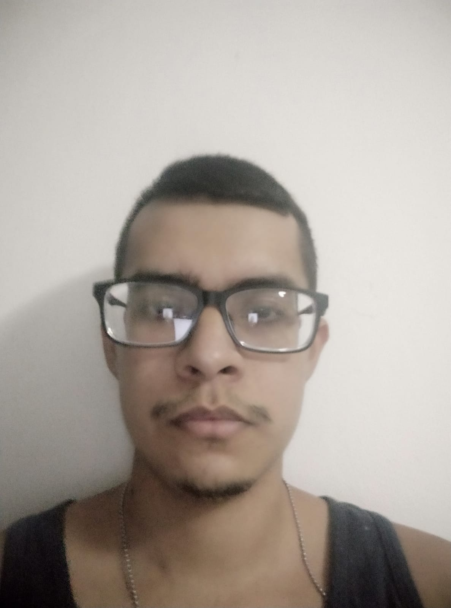

# Interacción Humano Computadora
Repositorio para el proyecto final de la Asignatura "Interacción Humano Computadora".

## Miembros del equipo:

|  |  |  |  | 
| :----: | :----: | :----: | :----: |
| [Carlos Josue Chan Gongora](https://github.com/Shadic78) | [Pedro Daniel Euan Chan](https://github.com/dongato99) | [Jorge Guerrero Orozco](https://github.com/llYOrchll) | [Juan José Durán Matos](https://github.com/Juancrack97) |